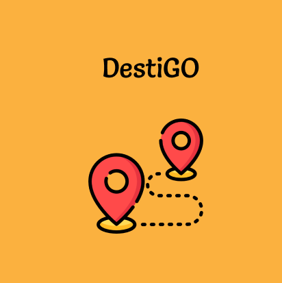

# Bangkit Capstone Project

This is a repository for DestiGo Apps which is the Product Based Capstone Project for Bangkit Academy 2023 Batch 1. This apps is created by team C23-PR578 with 3 Machine Learning Student, 2 Cloud Computing Student, and 1 Mobile Development Student.

## About DestiGo

 

  <a href="#">
    
  </a>

 

Destigo (Destination & Go) is an application that has features of various destination options according to user preferences where not only natural destinations but can be culinary destinations, arts and cultural destinations, and historical destinations. This will make it easier for tourists to choose tours according to their preferences

# Team Members

|            Member           |   Student ID  |        Path          |               University                   |                                     Contacts                                      |
| :-------------------------: | :-----------: | :------------------: | :----------------------------------------: | :-------------------------------------------------------------------------------: |
| Dyah Wahyu Permatasari      | M287DSY0062   |  Machine Learning    |        Universitas Negeri Surabaya         |   [LinkedIn](https://www.linkedin.com/in/dyah-wahyu-permatasari-742470201/)       |
| Roro Ayu Fasha Dewatri      | M287DSY2928   |  Machine Learning    |        Universitas Negeri Surabaya         |   [LinkedIn](https://www.linkedin.com/in/roro-ayu-fasha/)                         |
| Siskawati Simandalahi       | M181DSY2366   |  Machine Learning    |        Universitas Indonesia               |   [LinkedIn](https://www.linkedin.com/in/siskawatisimandalahi/)                   |
| Dzaky Hanif Arjuna          | C038DSX1603   |  Cloud Computing     |        Institut Teknologi Sepuluh November |   [LinkedIn](https://www.linkedin.com/in/junajunajeki/)                           |
| Dimas Triananda Murti Putra | C038DSX4911   |  Cloud Computing     |        Institut Teknologi Sepuluh November |   [LinkedIn](https://www.linkedin.com/in/dimas-triananda-murti-putra-971715190/)  |
| Sesilia Tiara Rahayu Ada    | A305DSY2752   |  Mobile Development  |        UPN Veteran Jawa Timur              |   [LinkedIn](https://www.linkedin.com/in/sesilia-tiara-rahayu-ada-b88678220/)     |

### Dataset
Our dataset utilizes several sources to search for little-known or "hidden gem" tourism data. The main source of our dataset is taken [here](https://www.kaggle.com/datasets/aprabowo/indonesia-tourism-destination) and from [Google Maps](https://maps.google.co.id/).

### Recommendation System
uses the **Content-based Filtering** method which is based on the assumption that items that are similar in terms of certain features or characteristics tend to be preferred by users who have similar preferences.

### Preference
Some of the references we used:
- Kaggle in [here](https://www.kaggle.com/code/cocokcocok/indonesian-tourism-simple-recomendation#Content-Based-Filtering) and [here](https://www.kaggle.com/code/alraviemutiarmahesa/content-based-user-filtering-recommender-system)
- Model content-based filtering in [here](https://medium.com/towards-data-science/building-a-content-based-book-recommendation-engine-9fd4d57a4da)
